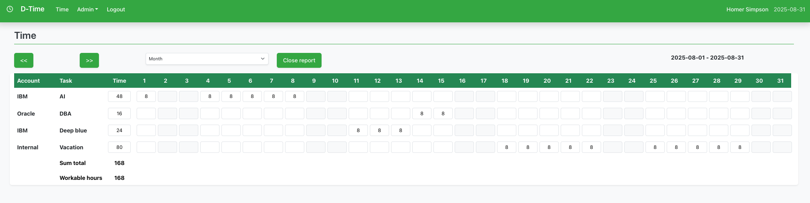
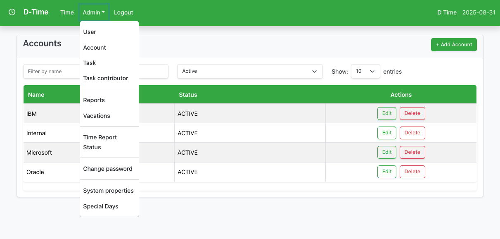

# DTime Application

A comprehensive time tracking and project management application built with modern technologies. DTime provides organizations with powerful tools to track work hours, manage projects, generate reports, and handle user administration through a clean, intuitive web interface.

## Application Overview

DTime is a full-featured time management solution designed for businesses and teams who need to track work hours across multiple projects and users. The application combines robust backend APIs with a responsive React frontend, all secured with modern authentication and HTTPS encryption.

### Key Features

**🕒 Time Tracking & Reporting**
- Individual time entry with project association
- Monthly time report generation and submission  
- Time report approval workflows
- Automated time tracking reminders
- Comprehensive reporting dashboards



**👥 User & Project Management** 
- Multi-role user system (Admin, User)
- Project and task organization
- User assignment to projects
- Account and contributor management
- OAuth2/OpenID Connect integration (Authentik)

**📊 Administration & Analytics**
- Complete administrative control panel
- System configuration management
- User role and permission management
- Special day (holidays) configuration
- Email notification system



**🔒 Security & Authentication**
- Secure HTTPS-only operation
- Session-based authentication
- CSRF protection
- Role-based access control
- Secure password handling

**🐳 Modern Architecture**
- Containerized deployment with Docker
- Separated frontend and backend services
- PostgreSQL database with automated migrations
- Runtime environment configuration
- Production-ready deployment scripts

## Project Structure

```
dtime/
├── backend/                 # Spring Boot API service
│   ├── src/main/java/
│   ├── src/main/resources/
│   ├── Dockerfile
│   └── pom.xml
├── frontend/                # React application
│   ├── src/
│   ├── public/
│   ├── Dockerfile           # Production build
│   ├── Dockerfile.dev       # Development build
│   ├── docker-entrypoint.sh # Runtime config injection
│   ├── package.json
│   └── webpack.config.js
├── database/                # PostgreSQL setup
│   ├── Dockerfile
│   ├── scripts/
│   └── backups/
├── build-docker.sh          # Main build script
├── build-backend-docker.sh  # Backend-only build
├── build-frontend-docker.sh # Frontend-only build
├── deploy.sh                # Deployment script
├── package.sh               # Distribution packaging
├── mcp/                     # MCP server (read-only API tools for AI clients)
├── ollama/                  # Ollama compose + bridge config (see ollama/README.md)
├── infra/                   # PostgreSQL + Authentik (see infra/README.md)
├── docker-compose.yml       # App stack (profiles: full-stack, production, mcp)
├── start-mcp.sh             # MCP prerequisites / run hints
├── .env.example             # Environment template
└── README.md
```

Module-specific details: [backend/README.md](backend/README.md), [frontend/README.md](frontend/README.md), [mcp/README.md](mcp/README.md), [ollama/README.md](ollama/README.md), [infra/README.md](infra/README.md).

### Ollama chat (admin)

Admin-only **Chat** at `/chat` in the frontend calls **`/api/ollama/api/chat`**, proxied to **ollama-mcp-bridge** (not raw Ollama), so MCP tools (users, tasks, time reports) are available.

**Requirements:** `dtime-mcp` healthy with machine JWT configured; `dtime-ollama` with a pulled model (default `llama3.2` — see [ollama/README.md](ollama/README.md#memory-and-model-choice) if you hit RAM limits).

```bash
docker compose --profile full-stack --profile mcp --profile ollama up -d
docker exec dtime-ollama ollama pull llama3.2
```

Local frontend dev (`npm start`): run the bridge on **localhost:8082** (compose above) or set `OLLAMA_BRIDGE_URL` in `.env` for webpack.

## Running the stack

Default **host ports** (see [docker-compose.yml](docker-compose.yml) header):

| Service | URL | Notes |
|---------|-----|--------|
| Frontend (dev) | https://localhost:3000 | Webpack dev server |
| Frontend (prod compose) | http://localhost:3000 | Nginx in container |
| Backend API | https://localhost:8443 | HTTPS (dev keystore) |
| MCP server | http://localhost:8081/mcp | Streamable HTTP MCP |
| Ollama | http://localhost:11434 | Profile `ollama` — local LLM |
| Ollama MCP bridge | http://localhost:8082 | Profile `ollama` — Chat API + tools |
| PostgreSQL | localhost:5432 | `dtime-db` or [infra](infra/README.md) |
| Authentik | http://localhost:9000 | [infra/authentik](infra/README.md) |

**1. Setup environment (once)**

```bash
cp .env.example .env
# Edit .env — OAuth, database, MCP_* and OAUTH_AUTHENTIK_MACHINE_JWT_* for MCP
```

### Development

**Option A — Docker (app + DB in root compose)**

```bash
# Database only (if not using infra/)
docker compose up -d dtime-db

# Backend + frontend (dev webpack container)
docker compose --profile full-stack up -d

# Optional: add MCP (needs Authentik + machine JWT in .env)
docker compose --profile full-stack --profile mcp up -d

# Optional: admin Chat with Ollama + MCP tools (requires mcp profile + pulled model)
docker compose --profile full-stack --profile mcp --profile ollama up -d
docker exec dtime-ollama ollama pull llama3.2
```

Or use the deploy script:

```bash
./build-docker.sh
./deploy.sh --env development
```

**Option B — Local processes (typical IDE workflow)**

```bash
# 1. Infrastructure: Postgres + Authentik
cd infra && cp .env.example .env && docker compose up -d
# See infra/README.md for Authentik first-time setup

# 2. Backend (profile dev → HTTPS :8443)
cd backend && SPRING_PROFILES_ACTIVE=dev mvn spring-boot:run

# 3. Frontend
cd frontend && npm install && npm start

# 4. MCP (optional — see mcp/README.md and ./start-mcp.sh)
cd mcp && mvn spring-boot:run
```

Sign in via Authentik: frontend https://localhost:3000 → backend https://localhost:8443 (see [Authentik setup](#authentik-setup-local-development) below).

### Production

**Docker (recommended)**

```bash
./build-docker.sh
./deploy.sh --env production
# Starts: dtime-db (if in compose), dtime-backend, dtime-frontend-prod (profile production)
```

```bash
# Manual compose (production frontend image)
docker compose --profile production up -d
```

Set `FRONTEND_BACKEND_URL` in `.env` to the **public HTTPS URL** of your backend (not `localhost` on a remote server).

**MCP in production:** use profile `mcp` with backend healthy and `MCP_*` / machine JWT vars set — see [mcp/README.md](mcp/README.md#docker).

**Option — distribution package:** `./package.sh --version v1.0.0` then deploy on the target host (see [Production Deployment](#production-deployment) below).

### Stop services

```bash
docker compose --profile full-stack --profile mcp --profile ollama down
docker compose --profile production down
```

## Build Scripts

### 🔨 Main Build Script
```bash
./build-docker.sh [OPTIONS]

# Examples:
./build-docker.sh                    # Build all images
./build-docker.sh --backend-only     # Build only backend
./build-docker.sh --frontend-only    # Build only frontend
./build-docker.sh --tag v1.0.0       # Tag images with version
./build-docker.sh --push             # Push to registry
```

### 🚀 Deployment Script
```bash
./deploy.sh [OPTIONS]

# Examples:
./deploy.sh --env production         # Production deployment
./deploy.sh --env development        # Development deployment
./deploy.sh --backup-db              # Backup database first
./deploy.sh --no-build               # Skip building images
```

### 📦 Packaging Script
```bash
./package.sh [OPTIONS]

# Examples:
./package.sh --version v1.0.0       # Create distribution package
./package.sh --no-source            # Package only Docker images
./package.sh --output ./releases    # Custom output directory
```

## Environment Configuration

All configuration is handled via runtime environment variables (no build-time secrets).

### Backend Environment Variables
```bash
# Database
POSTGRES_DB=dtime
POSTGRES_USER=dtime
POSTGRES_PASSWORD=your_secure_password

# OIDC (Authentik)
OAUTH_AUTHENTIK_ENABLED=true
OAUTH_AUTHENTIK_CLIENT_ID=your_client_id
OAUTH_AUTHENTIK_CLIENT_SECRET=your_client_secret
OAUTH_AUTHENTIK_AUTHORIZATION_URI=http://localhost:9000/application/o/authorize/
OAUTH_AUTHENTIK_END_SESSION_URI=http://localhost:9000/application/o/dtime/end-session/
OAUTH_AUTHENTIK_TOKEN_URI=http://localhost:9000/application/o/token/
OAUTH_AUTHENTIK_USER_INFO_URI=http://localhost:9000/application/o/userinfo/
OAUTH_AUTHENTIK_JWK_SET_URI=http://localhost:9000/application/o/dtime/jwks/

# Email Configuration
MAIL_USERNAME=your-email@example.com
MAIL_PASSWORD=your_email_app_password

# Security
SECURITY_CSRF_ENABLED=true
```

## Authentik Setup (Local Development)

Use this section if you want to start DTime with Authentik login on your local machine.

### 1) Start infrastructure

Start PostgreSQL and Authentik first — see [infra/README.md](infra/README.md) (`cd infra && docker compose up -d`), then backend and frontend per [Running the stack](#running-the-stack).

### 2) Create OAuth2 Provider/Application in Authentik

In Authentik, configure the DTime OAuth2/OpenID Connect application with:

- **Client type**: Confidential
- **Grant type**: Authorization Code
- **Redirect URI**: `https://localhost:8443/login/oauth2/code/authentik`
- **Scopes**: include at least `openid`, `email`, `profile`

Recommended:

- Keep issuer/slug aligned with your JWKS URL (example slug `dtime` -> `.../application/o/dtime/jwks/`)
- Make sure the provider returns `sub` and (preferably) `email`

### 3) Configure backend env vars

Set these when starting backend (or in your local env files):

```bash
OAUTH_AUTHENTIK_ENABLED=true
OAUTH_AUTHENTIK_CLIENT_ID=<authentik-client-id>
OAUTH_AUTHENTIK_CLIENT_SECRET=<authentik-client-secret>
OAUTH_AUTHENTIK_AUTHORIZATION_URI=http://localhost:9000/application/o/authorize/
OAUTH_AUTHENTIK_END_SESSION_URI=http://localhost:9000/application/o/dtime/end-session/
OAUTH_AUTHENTIK_TOKEN_URI=http://localhost:9000/application/o/token/
OAUTH_AUTHENTIK_USER_INFO_URI=http://localhost:9000/application/o/userinfo/
OAUTH_AUTHENTIK_JWK_SET_URI=http://localhost:9000/application/o/dtime/jwks/
SPRING_PROFILES_ACTIVE=dev
```

### 4) Start application

- Backend: `https://localhost:8443`
- Frontend dev server: `https://localhost:3000`

Open frontend and click **Sign in with Authentik**.

### 5) Expected behavior on first login

- User is created or updated in `dtime.users`
- Existing local user with same email is linked to the Authentik `sub` as `external_id`
- Roles for API authorization are mapped to `ROLE_USER` / `ROLE_ADMIN`

### Frontend Environment Variables
```bash
# Backend API URL (browser → backend; use HTTPS :8443 for local dev with Authentik)
REACT_APP_BACKEND_URL=https://localhost:8443

# Environment
NODE_ENV=production
```

## Technology Stack

### Backend
- Spring Boot 3.4.7
- Java 21
- PostgreSQL 14
- Hibernate/JPA
- Maven
- Docker multi-stage builds

### Frontend
- React 18.3.1
- Webpack 5.97.1
- Bootstrap 5.3.8
- Axios for API calls
- Runtime environment injection
- Nginx for production serving

### Infrastructure
- Docker & Docker Compose
- PostgreSQL official image
- Multi-stage Docker builds
- Runtime configuration injection
- Comprehensive build automation

## Default Admin Credentials

After first deployment:
- **Username**: `admin@dtime.se`
- **Password**: `admin123`

⚠️ **Change the admin password immediately after first login for security.**

## Production Deployment

### Prerequisites
- Docker & Docker Compose
- 2GB+ RAM
- 10GB+ disk space

### Security Checklist
- ✅ Change default admin password
- ✅ Set secure database passwords
- ✅ Enable CSRF protection (`SECURITY_CSRF_ENABLED=true`)
- ✅ Use HTTPS with reverse proxy
- ✅ Configure firewall rules
- ✅ Regular database backups

### Deployment Options

**Option 1: Full Docker Stack**
```bash
# Production deployment (backend + production frontend; add --profile mcp in compose if needed)
./deploy.sh --env production --backup-db

# Monitor deployment
docker compose logs -f
docker compose ps
```

**Option 2: Custom Registry**
```bash
# Build and push to registry
./build-docker.sh --registry registry.company.com/ --push

# Deploy from registry
./deploy.sh --registry registry.company.com/ --no-build
```

**Option 3: Distribution Package**
```bash
# Create distribution package
./package.sh --version v1.0.0

# Deploy on target system
tar -xzf dist/dtime-v1.0.0.tar.gz
cd dtime-v1.0.0
./load-images.sh
./scripts/deploy.sh
```

## CI/CD Pipeline

DTime includes a comprehensive GitHub Actions CI/CD pipeline that automates building, testing, and deployment validation.

### 🔄 Workflows

**Main CI/CD Pipeline (`.github/workflows/ci-cd.yml`)**
- Triggers on push to `main`/`master`/`develop` branches and pull requests
- **Frontend Build**: Node.js setup, dependency installation, linting, testing, and production build
- **Backend Build**: Java 21 setup, Maven caching, testing with PostgreSQL, and JAR packaging
- **Docker Build**: Multi-platform container images published to GitHub Container Registry
- **Integration Testing**: Full stack deployment testing with health checks
- **Deployment Validation**: Script validation and docker-compose verification
- **Security Scanning**: Vulnerability scanning with Trivy

**Release Pipeline (`.github/workflows/release.yml`)**
- Triggers on version tags (`v*`)
- Builds and publishes tagged Docker images
- Creates distribution packages with deployment scripts
- Generates release notes with change logs
- Creates GitHub releases with artifacts

**Performance Testing (`.github/workflows/performance.yml`)**
- Scheduled weekly performance tests
- Load testing with k6
- Performance metrics and reporting
- Can be manually triggered with custom duration

**Documentation (`.github/workflows/docs.yml`)**
- Validates markdown files and documentation structure
- Checks for required documentation sections
- Auto-generates API documentation
- Updates build status badges

### 🔧 Dependency Management

**Dependabot Configuration (`.github/dependabot.yml`)**
- Weekly dependency updates for npm packages
- Weekly dependency updates for Maven dependencies  
- Monthly GitHub Actions updates
- Automated security vulnerability patches

### 🐳 Container Images

The pipeline automatically builds and publishes Docker images to GitHub Container Registry:

```bash
# Latest images (from main branch)
ghcr.io/mikael/dtime/backend:latest
ghcr.io/mikael/dtime/frontend:latest

# Tagged releases
ghcr.io/mikael/dtime/backend:v1.0.0
ghcr.io/mikael/dtime/frontend:v1.0.0

# Branch-specific builds
ghcr.io/mikael/dtime/backend:develop-abc1234
ghcr.io/mikael/dtime/frontend:develop-abc1234
```

### 🚀 Deployment Strategy

**Development**
- Automatic builds on feature branches
- Integration testing on every pull request
- Branch-specific container tags for testing

**Staging** 
- Automatic deployment to staging on merge to `develop`
- Full integration and performance testing
- Security scanning and vulnerability checks

**Production**
- Manual approval required for production deployment
- Tagged releases with semantic versioning
- Rollback capabilities with previous image versions
- Health checks and deployment validation

### 🔍 Monitoring & Quality

**Automated Testing**
- Unit tests for both frontend and backend
- Integration tests with real database
- End-to-end deployment validation
- Performance benchmarking

**Security & Compliance**
- Container vulnerability scanning
- Dependency security updates
- HTTPS-only deployment validation
- Security policy compliance checks

**Code Quality**
- Linting for JavaScript/TypeScript and Java
- Code coverage reporting
- Documentation validation
- Consistent formatting and style

### 📊 Status & Metrics

Monitor the health of your deployment and CI/CD pipeline:

- **Build Status**: Check GitHub Actions for build history
- **Container Images**: View published images in GitHub Packages
- **Security Alerts**: Review Dependabot security advisories  
- **Performance**: Check weekly performance test results
- **Documentation**: Validate documentation completeness

### 🛠️ Local Development

For local development that mirrors the CI/CD environment:

```bash
# Run the same linting as CI
cd frontend && npm run lint
cd backend && mvn checkstyle:check

# Run the same tests as CI  
cd frontend && npm test -- --coverage --watchAll=false
cd backend && mvn test

# Build the same Docker images as CI
./build-docker.sh --tag local-test

# Test deployment locally
./deploy.sh --env development
```
